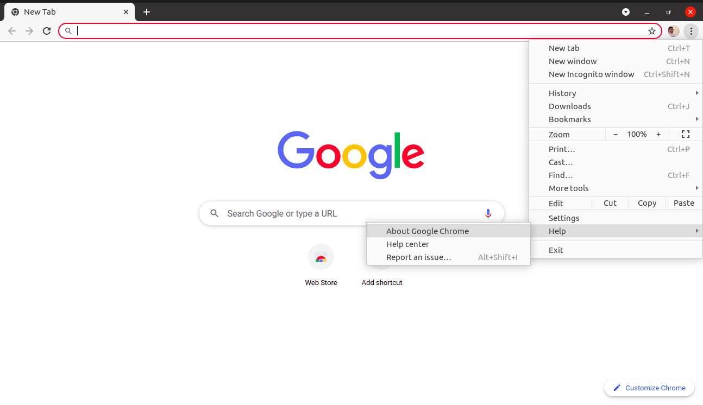

# Prova Técnica DBC
Este arquivo possui como objetivo apresentar ao público uma automação em página Web realizada utilizando o framework RobotFramework e a biblioteca Selenium na linguagem de programação Python. No decorrer do documento serão dados mais detalhes acerca do processo de teste.

## Configurações do sistema
* Ubuntu 20.04 LTS
* Intel® Core™ i5-3337U
* 8GB RAM

## Desafio 01 (WebAutomation com Selenium e Java)
* Dependências
* Como instalar
* Como executar
* Interpretando o relatório

## Dependências

- [ ] Open JDK 1.8
- [ ] Maven
- [ ] Intellij IDEA Community (Opcional)
- [ ] Selenium Web Driver
- [ ] Chromedriver  


## Como instalar
O tutorial será direcionado para execução no sistema operacional Ubuntu, visto que este foi o sistema utilizado pelo autor para execução dos testes.
### Open JDK 1.8
Antes de instalar é interessante se já existe alguma versão do java instalado na sua máquina, para isso você pode executar o comando `java -version`. Caso haja qualquer resultado diferente de: 
<pre>openjdk version &quot;1.8.0_292&quot;
OpenJDK Runtime Environment (build 1.8.0_292-8u292-b10-0ubuntu1~20.04-b10)
OpenJDK 64-Bit Server VM (build 25.292-b10, mixed mode)</pre>
É possível instalar o JDK (Java Development Kit) 8 através do comando:
```bash
get install openjdk-8-jdk
```
Após isso há dois caminhos possíveis, caso exista outra versão do java na sua máquina você precisa apontar para a versão do jdk8 através do comando `sudo update-alternatives --config java` e selecionar a opção possivelmente representada por <pre>/usr/lib/jvm/java-8-openjdk-amd64/jre/bin/java</pre>
Caso não haja outra versão do Java você pode prosseguir com os próximos passos. 


### Maven
Para instalar o maven é necessário haver o Java já instalado na sua máquina, caso você tenha instalado neste tutorial é recomendado executar o comando `sudo apt update` antes de prosseguir. Para instalar o Maven é possível executar o comando 
```bash
sudo apt install maven
```
Após isso basta verificar se o maven foi instalado corretamente através do comando `mvn -version`

### Intellij IDEA Community
O uso da IDE (Integrated Development Environment) Intellij é opcional e você pode ficar a vontade para utilizar a que se sentir mais confortável, porém será demonstrado apenas o processo de instalação do intellij por ser a IDE utilizada neste projeto. Caso você ainda não tenha o intellij instalado na sua máquina, é possível instalar através do comando:
```bash
sudo snap install intellij-idea-community --classic --edge
```


### Dependências e plugins
O Maven é uma plataforma de gestão de bibliotecas utilizada primariamente em projetos Java, a manipulação de bibliotecas e plugins no projeto se dá através de um arquivo denominado `pom.xml`, nele você armazena as dependências que seu projeto utilizará e o maven da automaticamente instala tudo o que você precisa. No escopo deste projeto, foram adicionadas os seguintes plugins e dependências:

Dependências:


Plugins:

### Webdriver
Para realizar o teste de um sistema Web através de um navegador é necessário ter instalado o webdriver do navegador a ser utilizado, no caso deste projeto o navegador escolhido foi o Google Chrome. Para realizar a instalação, primeiramente é necessário saber qual a versão atual do seu navegador chrome, que pode ser encontrada seguindo os passos demonstrados nas imagens a seguir:



Depois de identificar a versão do chrome, acessar o link https://chromedriver.chromium.org/downloads, selecionar a versão verificada anteriormente nas imagens e baixar o arquivo "chromedriver_linux64.zip". Após concluído o download, abrir o diretório onde o arquivo foi baixado, clicar com o botão direito do mouse e selecionar a opção "Abrir no terminal", estando no terminal digitar o comando ```sudo mv chomedriver /usr/local/bin/```. Tendo feito tudo isso você pode confirmar a instalação do chromedriver através do comando ```chromedriver --version```

## Como executar

## Bugs Identificados


